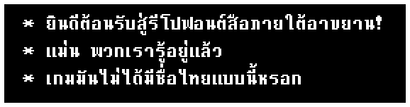
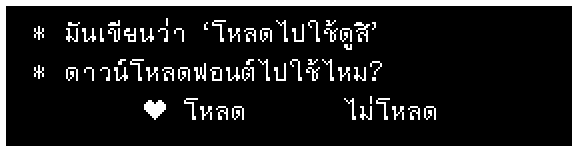
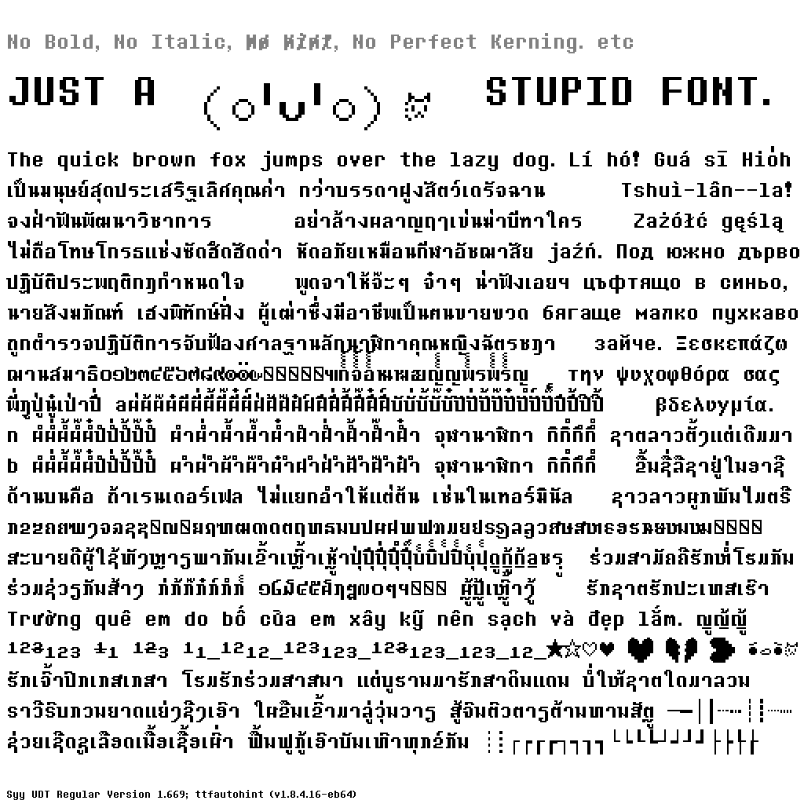
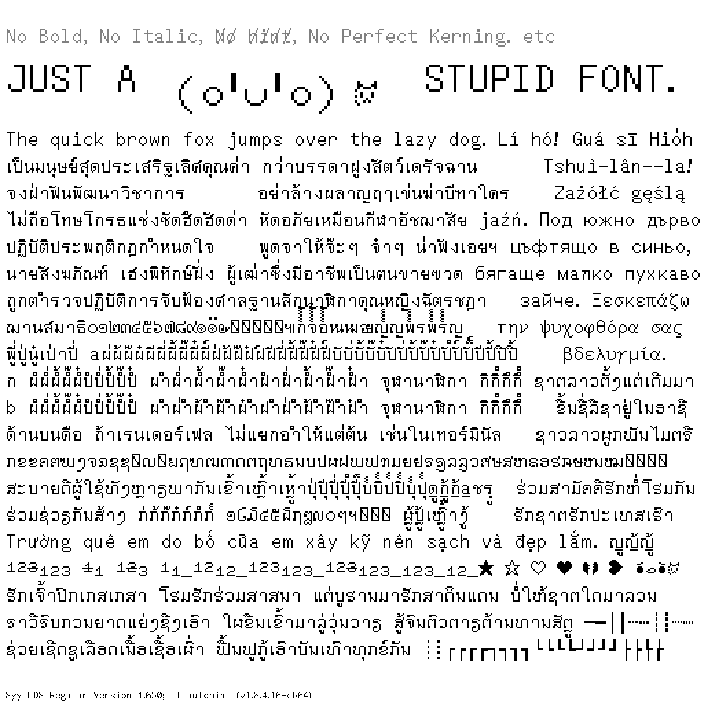
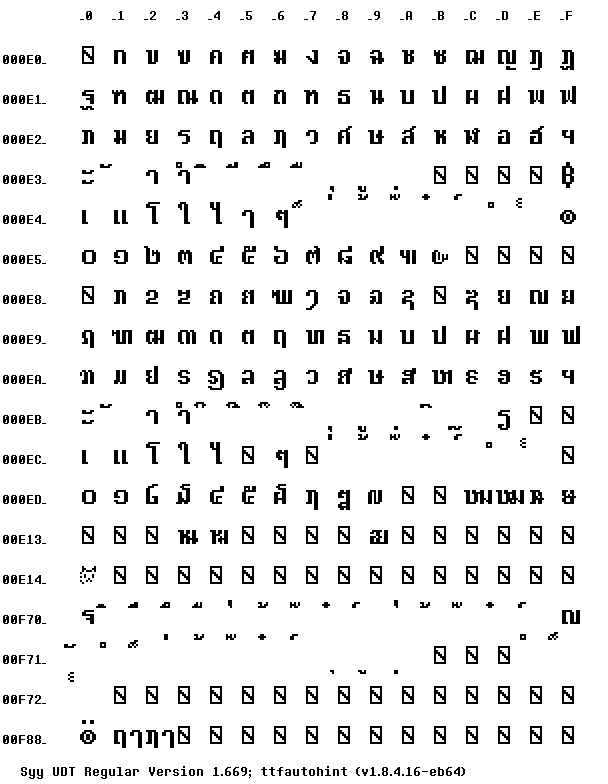
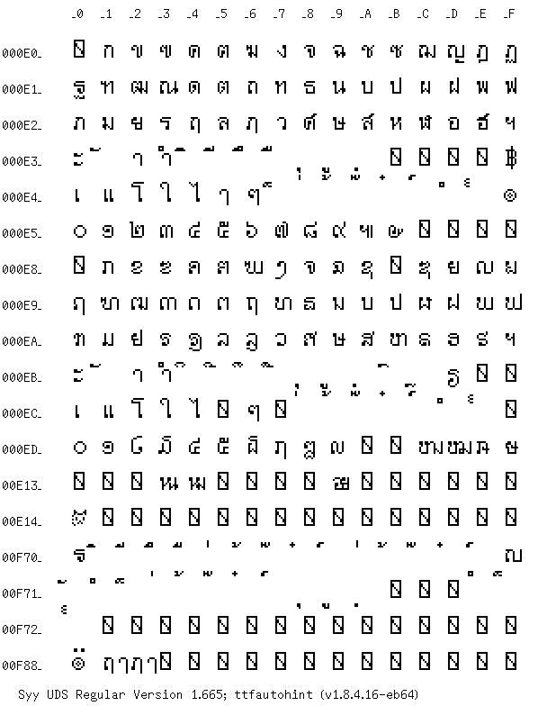

# Syy BENEATHPOEM

  


- `Syy UDT Regular`: Based on **ตัวหนา** used in-game
- `Syy UDS Regular`: Based on ตัวบาง used in-game

Supported scripts
- Latin: including Vietnamese
- Cyrillic: Basic
- Greek: Basic
- Thai
- Lao
- Box Drawing

> **NOTE: THIS FONT IS NOT MONOSPACE!**  
> It still works well(?) in terminals, except that wide characters may overlap the next character.  
> aaaand if u use it in-game, have fun handling variable-width characters like we do in our mod :skull:

This font is pixel-fit at 16px, 16pt at 72 DPI, and 12pt at 96 DPI.


# Download
see the [fonts folder](fonts)
```
├── fonts
│   ├── ttf      <- Recommended for general-purpose use
│   ├── webfonts <- Optimized for use on websites (in `.woff2`)
│   └── unhinted
│       ├── otf
│       ├── ttf
│       └── webfonts
```

# Contribute & How to build
Please see [`CONTRIBUTING.md`](CONTRIBUTING.md) 

# License
Copyright 2026 The Syy BENEATHPOEM Project Authors (https://github.com/Plaenithaan/Syy-BENEATHPOEM)

This Font Software is licensed under the SIL Open Font License, Version 1.1.
This license is copied in [OFL.txt](OFL.txt), and is also available with a FAQ at:
http://scripts.sil.org/OFL

# Changelog
Please see [`FONTLOG.md`](FONTLOG.md) for full version history and release notes.

# Sample texts
<table align="center"><tr><td align="center" width="9999">

  
  
  
  

</td></tr></table>